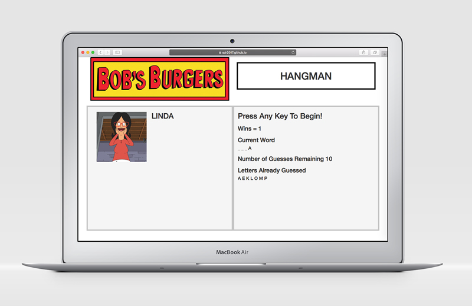

# Bob's Burgers Hangman

What do you do when you've run out of Bob's Burgers episodes to binge watch? Play Bob's Burgers Hangman of course!

At the start of the game, a random character from the show is picked from an array and a line is displayed for each letter in their name. The user taps letters on their keyboard to guess letters in the name. If the letter guessed is a part of the character's name, the letter appears in the word as well as in "letters guessed." If the user guesses incorrectly, the letter appears in "letters guessed" and their "number of guesses remaining" goes down by one. If the user guesses all the letters of the character's name, they win! A photo of the character is displayed, Linda says "Alll Riiiiiight!" and their win tally is incremented by 1. If the user runs out of guesses, they lose the game. In each situation, the game automatically restarts. 

## Technologies Used
The app is built with HTML, CSS, Bootstrap for layout, and vanilla JavaScript for functionality.

---

To play the game, click here: https://sdr2017.github.io/Hangman-Game/

Device mockups from www.pixeden.com